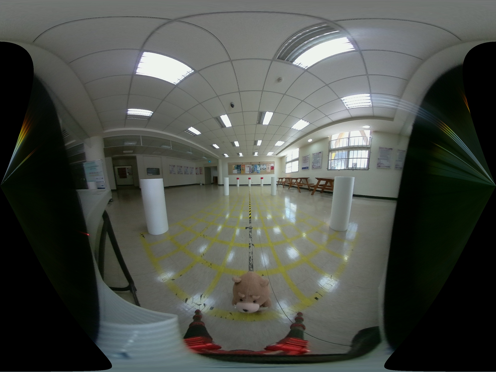

# Moil HTTP Client

A project for moil Client/Server architecture, tested on ubuntu 18.04. Suppose the server is more powerful and offer the computing service, the client can get the anypoint MAPs and panorama pictures from the server. With a the similar structure, this project is easy to be integrated to be a part of Mainmoil_6view project.
<br/><br/>

MOIL HTTP Server   ---->  MOIL HTTP Client


<br/><br/>

example acquired panorama.jpg

## 1. Requirement

	install curllpp, download the source code then compile, please check
 
```sh
	http://www.curlpp.org/
```


## 2. Build and Run


```sh
	git clone https://github.com/yourskc/moil_httpclient.git
	cd  moil_httpclient
	( Make sure server is running, modify the address of the moil http server )
	mkdir build
	cd build
	cmake ..
	make
	./moilclient
```

## 3. MOIL Http Server

Please reference the repo, 

https://github.com/yourskc/moil_httpserver

Run a HTTP server before the running of a client.


